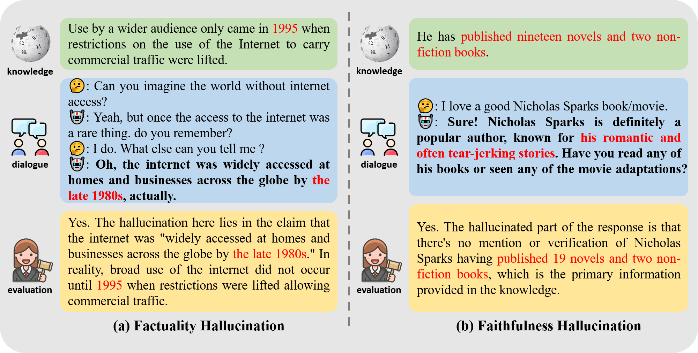

<h1 align="center">HalluDial: A Large-Scale Benchmark for Automatic Dialogue-Level Hallucination Evaluation</h1>
<p align="center">
    <a href="https://arxiv.org/abs/2406.07070">
            
    </a>
    <a href="https://drive.google.com/drive/folders/19POyHTlLc3iQKKR4oonZzIGLEQ94Wyjl?usp=sharing">
        
    </a>
</p>

This repository contains the data and code for the paper "[HalluDial: A Large-Scale Benchmark for Automatic Dialogue-Level Hallucination Evaluation](https://arxiv.org/abs/2406.07070)."



## 📋 Table of Contents

- [🧩 HalluDial](#-halludial)
  - [📋 Table of Contents](#-table-of-contents)
  - [📖 Usage](#-usage)
    - [Downloading the Dataset](#downloading-the-dataset)
    - [Documentation and Examples](#documentation-and-examples)
      - [Spontaneous Hallucination Scenario](#spontaneous-hallucination-scenario)
      - [Induced Hallucination Scenario](#induced-hallucination-scenario)
      - [Dataset Structure](#dataset-structure)
    - [Loading the Dataset](#loading-the-dataset)
    - [Evaluating](#evaluating)
      - [Installation](#installation)
      - [Hallucination Detection](#hallucination-detection)
      - [Hallucination Localization and Rationale Provision](#hallucination-localization-and-rationale-provision)
  - [📝 Citing](#-citing)

## 📖 Usage

### Downloading the Dataset

The HalluDial dataset can be downloaded from [here](https://drive.google.com/drive/folders/19POyHTlLc3iQKKR4oonZzIGLEQ94Wyjl?usp=sharing). After downloading, please extract the contents to the `data` directory. The file structure should look like this:

```
HalluDial
├── data
│   ├── spontaneous
│   │   ├── spontaneous_train.json
│   │   └── ...
│   └── induced
│       ├── induced_train.json
│       └── ...
└── ...
```

### Documentation and Examples

The HalluDial dataset includes two types of hallucination scenarios: the spontaneous hallucination scenario and the induced hallucination scenario, representing two different data construction processes. Each scenario is further split into training and test sets. The dataset is provided as JSON files, one for each partition: `train.json`, `test.json`. The splits are sized as follows:

#### Spontaneous Hallucination Scenario

| Split | # Samples |
|:-------|:---------:|
| `train` |   55071   |
| `test`  |  36714     |
| `total` |  91785     |

#### Induced Hallucination Scenario

| Split | # Samples |
|:-------|:---------:|
| `train` |   33042   |
| `test`  |   22029      |
| `total` |  55071     |

#### Dataset Structure

Each JSON file contains a list of dialogues, where each dialogue is represented as a dictionary. Here is an example dialogue:

```json
{
    "dialogue_id": 0,
    "knowledge": "Use by a wider audience only came in 1995 when restrictions on the use of the Internet to carry commercial traffic were lifted.",
    "dialogue_history": "[Human]: Can you imagine the world without internet access? [Assistant]: Yeah, but once the access to the internet was a rare thing. do you remember? [Human]: I do. What else can you tell me ?",
    "turn": 1,
    "response": "Oh, the internet was widely accessed at homes and businesses across the globe by the late 1980s, actually.",
    "target": "Yes. The hallucination here lies in the claim that the internet was \"widely accessed at homes and businesses across the globe by the late 1980s.\" In reality, broad use of the internet did not occur until 1995 when restrictions were lifted allowing commercial traffic.",
}
```

where

- `dialogue_id`: a unique identifier for the dialogue. Matching dialogue IDs indicate that the knowledge and the dialogue history are the same.
- `knowledge`: the knowledge provided for the dialogue.
- `dialogue_history`: the dialogue history.
- `turn`: the turn in the dialogue.
- `response`: the response generated by the model.
- `target`: the hallucination evaluation result, including the results of hallucination detection, hallucination localization, and rationale provision.

### Loading the Dataset

The data can be loaded the same way as any other JSON file. For example, in Python:

```python

spontaneous_dataset = {
    "train": json.load(open("data/spontaneous/spontaneous_train.json")),
    "test": json.load(open("data/spontaneous/spontaneous_test.json"))
}

induced_dataset = {
    "train": json.load(open("data/induced/induced_train.json")),
    "test": json.load(open("data/induced/induced_test.json"))
}
```

### Evaluating

We provide example scripts to conduct meta-evaluations of the hallucination evaluation ability of Llama-2 on the HalluDial dataset.

#### Installation

To install the required dependencies, run:

```bash
pip install -r requirements.txt
```

#### Hallucination Detection

To evaluate the hallucination detection performance, run:

```bash
sh example/eval_detect.sh
```

#### Hallucination Localization and Rationale Provision

To evaluate the hallucination localization and rationale provision performance, run:

```bash
sh example/eval_rationale.sh
```

## 📝 Citing

If you use the HalluDial dataset in your work, please consider citing our paper:

```
@misc{luo2024halludial,
      title={HalluDial: A Large-Scale Benchmark for Automatic Dialogue-Level Hallucination Evaluation}, 
      author={Wen Luo and Tianshu Shen and Wei Li and Guangyue Peng and Richeng Xuan and Houfeng Wang and Xi Yang},
      year={2024},
      eprint={2406.07070},
      archivePrefix={arXiv},
      primaryClass={cs.CL}
}
```
